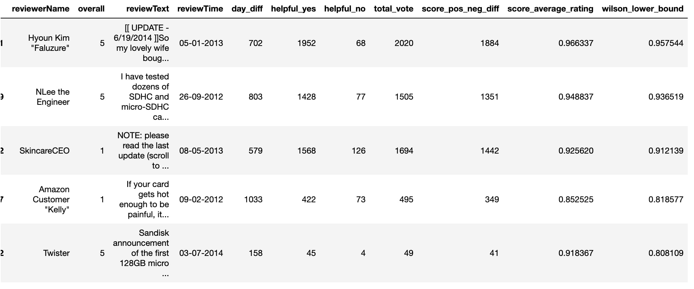
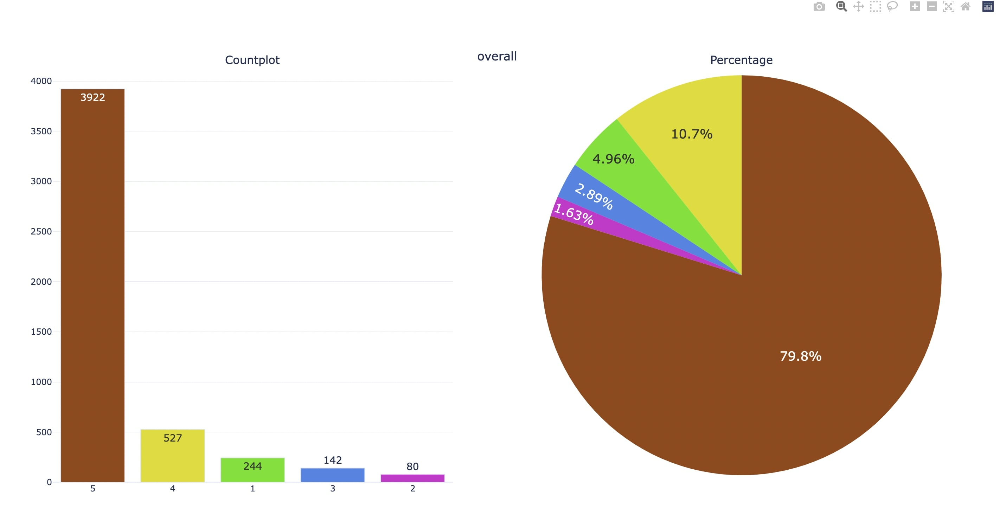

# Sentiment Analysis Project

## Overview

This repository contains a Jupyter Notebook that performs sentiment analysis on customer reviews or textual data. The sentiment analysis is conducted using a variety of Python libraries for data cleaning, visualization, and classification of sentiments, providing a detailed overview of the dataset's sentiment distribution.

## Dataset

The dataset consists of customer reviews from Amazon, including information such as reviewer name, overall rating, review text, review time, helpful votes, and computed sentiment-related metrics.




## Data Cleaning Process

The data cleaning process involves handling missing values, removing duplicates, and standardizing data formats to ensure consistency, along with other preprocessing steps for text normalization, such as removing special characters and stopwords.


## Features

- **Sentiment Analysis Tools**: Uses `nltk`'s `SentimentIntensityAnalyzer` and `TextBlob` for scoring the sentiment of each text, categorizing it as positive, neutral, or negative.
- **Exploratory Data Analysis (EDA)**: Includes visual representations of key statistics using tools such as `matplotlib`, `seaborn`, and `plotly`.
- **Data Preprocessing**: The notebook includes preprocessing steps like handling missing values, normalizing text, removing stopwords, and more.
- **Visualization**:
  - **WordClouds**: Generated to visualize the most common words in positive, negative, and neutral sentiments.
  - **Histograms and Pie Charts**: Used for visualizing the distribution of sentiment scores.
  - **Interactive Plots**: Generated with Plotly for better insights and data exploration.



 
- **Custom Utility Functions**:
  - `missing_values_analysis()`: Identifies missing values and provides a summary.
  - `check_dataframe()`: Analyzes dataset characteristics such as data types, missing values, duplicated entries, and quantiles.
  - Additional preprocessing functions for text cleaning and tokenization.

## Dependencies

The following Python libraries are required to run the notebook:

- `numpy`
- `pandas`
- `nltk`
- `textblob`
- `matplotlib`
- `seaborn`
- `plotly`
- `cufflinks`
- `wordcloud`

You can install these libraries using the following command:

```sh
pip install numpy pandas nltk textblob matplotlib seaborn plotly cufflinks wordcloud
